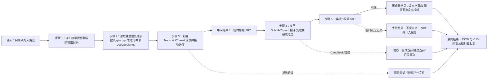

# 无界面批量视频处理计划

## 需求

- 提供一个可双击运行的 BAT，不打开 VideoCaptioner 图形界面。
- 用户输入一个目录后，递归处理其下全部受支持视频。
- 显示当前文件进度、总体文件进度和处理状态。
- 统计成功、跳过及各种错误，并生成可审计报告。
- 不发布空白、仅序号/时间轴而无正文、或无法解析的 SRT。
- 空白、无正文或无法解析的 SRT 必须归入错误统计，不得仅静默跳过。
- 每个视频统计句子数量，并写入控制台汇总及结构化报告。
- 遇到 DeepSeek 连接、鉴权、限流或服务端错误时立即暂停批次。
- 不在脚本、日志或报告中输出 API Key。
- GUI 与批处理脚本使用两套完全分离的参数源，互不读取、同步或回退。
- 批处理参数文件最前两项必须依次为源语言和翻译目标语言；只有这两项允许用户修改。
- `D:\CODE\PY\VideoCaptioner\config` 下明确分为 `gui/` 与 `batch/` 两个配置文件夹。

## 现有能力与结论

- 复用 `videocaptioner.ui.task_factory.TaskFactory`、`TranscriptThread`、`SubtitleThread` 和已有 Qt 进度信号。
- 不采用现成 `videocaptioner process` 作为主路线：它不支持 GUI 当前选用的本地 `FasterWhisper medium/CUDA`，会改变识别引擎和结果。
- 不直接复用 `BatchProcessThread` 的队列循环：其错误处理会继续取后续任务，不能满足“DeepSeek 错误立即暂停并由用户决定”的要求。
- 新增最小编排层，顺序调用现有转录和字幕处理能力；BAT 只负责稳定启动项目虚拟环境中的 Python。
- 固定批处理配置为：本地 FasterWhisper medium/CUDA、DeepSeek `deepseek-flash`、不开启优化/断句、只生成 SRT、不合成视频。运行时 GUI 的任何配置变更均不影响脚本。
- 只将配置入口分为 `config/gui/` 与 `config/batch/`；源码、模型、FFmpeg、FasterWhisper、资源及其他运行组件继续共用，不复制两套。
- 将现有 GUI 设置整理到 `config/gui/`；同步修正 GUI 启动路径并验证原配置仍可读取。缓存、日志等运行数据不作为第二套配置复制。
- 在 `config/batch/` 新增无敏感信息的 `batch_config.toml`。文件中的第一、第二项依次为 `source_language` 与 `target_language`，默认分别为 `ja` 和 `zh-Hans`；后续 `[fixed]` 段清晰列出固定参数，脚本会校验这些值且不允许覆盖，未知字段会被拒绝。
- DeepSeek API Key 不固化到代码或任何设置文件。GUI 与批处理共同只读项目根目录 `secrets/deepseek-api-key.txt`；工作区可用明文，Git index 与 commit 必须经 `git-crypt` 加密。

## 方案设计

### 文件

- 项目根目录 `batch_videos.bat`：双击入口，支持把目录拖到 BAT 上或启动后输入路径。
- `config/gui/`：GUI 专用设置目录，批处理无权读取；共享运行组件不放入该目录的独立副本。
- `config/batch/batch_config.toml`：批处理专用配置；第一、第二项为源语言与翻译目标语言，其余参数在 `[fixed]` 段以固定值明确展示。
- `secrets/deepseek-api-key.txt`：GUI 与批处理唯一共用的真实 Key；不属于任一配置参数集。
- `scripts/headless_batch.py`：目录枚举、无界面处理、进度、暂停、SRT 校验、发布和报告。
- `tests/test_headless_batch.py`：路径枚举、SRT 校验、错误分类、DeepSeek 暂停决策等无网络测试。
- 必要时更新 `README.md`、`CHANGELOG.md` 和 `AGENT_CONTEXT.md`；若这些文档尚不存在，只创建职责确实需要的最小内容。

### 数据流

### 进度与错误

- 控制台显示两层文本进度条：`总体 已完成/总数` 与 `当前文件 0–100%`，并显示转录、翻译、校验、发布状态。
- 错误至少分类为：`deepseek_connection`、`deepseek_auth`、`deepseek_rate_limit`、`deepseek_server`、`asr`、`ffmpeg`、`invalid_or_blank_srt`、`input`、`unknown`。
- 每个视频记录相对路径、开始/结束时间、耗时、状态、原始句子数、最终句子数、错误类别和经过脱敏截断的错误摘要。
- 句子数定义为 SRT 中“同时具有合法时间轴与非空正文”的 cue 数量；控制台展示最终句子数，JSON/CSV 同时记录原始与最终数量。
- DeepSeek 错误暂停时提供：`R` 重试当前文件、`S` 跳过当前文件、`Q` 结束本批次；不自动继续消耗请求。
- 非 DeepSeek 单文件错误默认记录后继续，批次末尾统一汇总。

### 输出与空白 SRT 防护

- 所有处理中间文件先进入临时工作目录。
- SRT 发布前必须至少包含一个时间轴块及非空正文；失败产物不复制到最终目录。
- 空文件、只有空白字符、只有序号/时间轴而没有正文、或完全没有合法 cue 的结果统一记为 `invalid_or_blank_srt` 错误。
- 视频目录只发布一个与视频同名的 `<视频名>.srt`；中间文件使用临时目录，报告写入项目 `~outputs-final/batch-reports/`。
- 默认不覆盖已存在的有效结果；记录为 `skipped_existing`。可通过命令行 `--overwrite` 显式覆盖。

## 实施任务

- [x] 按确认结果创建并切换 `codex/headless-batch` 分支。
- [x] 实现无界面批量编排器和 BAT 入口。
- [x] 将配置入口整理为 `config/gui/` 与 `config/batch/`，验证 GUI 启动路径，并确保源码、模型、FFmpeg/FasterWhisper 与资源仍为一份共享组件。
- [x] 在 `config/batch/` 新增第一、第二项依次为源语言和目标语言的 `batch_config.toml`，明确展示固定参数，并验证未知字段、固定值变更和非法语言代码。
- [x] 实现视频扩展名筛选、输出目录排除和防重复处理。
- [x] 固定 FasterWhisper、DeepSeek、无优化/断句及仅 SRT 参数；从加密管理的共享 `secrets/` 读取 Key，并落实设置文件分离及输出脱敏边界。
- [x] 实现双层进度条、错误分类、DeepSeek 暂停交互。
- [x] 实现临时产物、SRT 有效性校验、句子计数和安全发布。
- [x] 实现包含每视频句子数及错误分类的 JSON/CSV 报告与控制台汇总。
- [x] 添加无网络单元测试，并以伪造处理器完成端到端批次验证。
- [x] 使用用户指定的两个真实视频执行 FasterWhisper 与 DeepSeek 端到端测试。
- [x] 更新必要文档和变更记录。
- [x] 检查 diff、运行测试并只提交本次新增的无敏感文件。
- [x] 将本计划移至 `docs/finished_plans/`，在 `docs/lessons/` 写精简复盘并提交。

## 验证结果

- 9 项本地自动测试通过；新增共享密钥空文件测试后共 10 项。
- DeepSeek 临时短句真实调用成功，Key 在控制台完全省略。
- 用户指定视频一：原始与最终均为 136 个有效 cue，最终 SRT 12,523 字节。
- 用户指定视频二：原始与最终均为 12 个有效 cue，最终 SRT 1,022 字节。
- `git-crypt` 暂存态审计：`PASS: real=1; examples=1; failures=0`。

## 用户确认结果

已确认：`config/` 分为 `config/gui/` 与 `config/batch/`；GUI 与脚本使用两套完全分离的参数；脚本固定 FasterWhisper medium/CUDA、DeepSeek `deepseek-flash`、无优化/断句、仅输出 SRT；`config/batch/batch_config.toml` 最前两项依次为源语言和目标语言且只有这两项可修改；脚本不读取 GUI Key；空白/无正文结果归入错误统计；报告记录每个视频的句子数。

用户选择 `BABA`：

1. 输出到每个源视频旁边，且只保留与视频同名的 `<视频名>.srt`；其他产物放在项目中。
2. DeepSeek 暂停后提供 `R` 重试、`S` 跳过、`Q` 结束。
3. 使用 DeepSeek 对短片段进行一次真实翻译测试，允许产生少量费用。
4. 允许创建 `codex/headless-batch`、新增计划内文件、运行测试产生可重建临时文件，并提交本次无敏感修改；现有未跟踪 `config/`、`reference/` 等旧内容不整体纳入提交。
