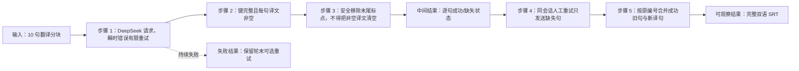

# DeepSeek 不完整输出通用修复计划

## 需求与边界

- 查询现存全部历史 `deepseek_incomplete_output` 记录，不只检查最近的“新建文件夹”批次。
- 按根因做通用修复，不按视频、路径、句号或固定字幕编号特判。
- 保持现有行为：失败视频不发布残缺 SRT；轮末仍由用户选择是否重试 DeepSeek 错误。
- 同一批处理会话中，错误后紧接的人工重试必须复用已经成功的句子，只请求缺失句子，减少 Token。
- 不修改固定模型、10 线程、每块 10 句等现有项目参数；不引入新依赖，不改锁定的上游源码。

## 历史审计结论

- 已在实时批次事件日志中找到 8 次，在较早最终报告中找到 14 次，共 22 次、涉及 16 个视频。
- 单句或少量离散缺译主要是 DeepSeek 把短句译为纯 `，。`，随后上游 `ASRData.remove_punctuation()` 将非空译文清成空字符串。
- 整块 10 句缺译主要是 HTTP 200 空内容、`finish_reason=length`、连接中断等瞬时请求失败；上游对少于 50% 的失败会降级为空译文，最终才被项目发布前校验发现。
- 大段缺译曾由 `incomplete chunked read` 触发；本项目请求日志钩子的异常分支又读取未完成的 `response.text`，把原始异常覆盖成 `httpx.ResponseNotRead`。
- 撤销“删除无语义源 cue”不是上述问题的原因；已确认的源句均含正常日文字符。
- 现有轮末 DeepSeek 重试会复用完整的 10 句分块，但遇到分块内只有 1 句缺译时仍会重译同块其余 9 句，尚未达到“跳过成功句子”的要求。

## 方案比较

| 路线 | 内容 | 结论 |
|---|---|---|
| A：整视频自动重跑 | 任一缺译后重新执行整段翻译 | 排除：浪费 Token，且改变当前人工轮末重试约定 |
| B：仅降低并发 | 把 10 线程调低以减少连接压力 | 排除：不能修复纯标点清空、空响应和旧不完整缓存，且固定参数不在本次范围 |
| C：请求层恢复 + 安全后处理 + 句级复用 | 对瞬时错误做有限重试，保护纯标点译文，拒绝不完整缓存；人工重试只补缺失句子 | 采用：覆盖全部已确认根因且保持现有工作流 |

## 实施

- [x] 新增独立的翻译韧性本地补丁，并通过 `sitecustomize.py` 与无界面批处理显式安装。
- [x] 对连接错误、超时、响应体中断及 HTTP 200 空内容进行最多 3 次带抖动退避的请求级尝试；鉴权、参数等永久错误不自动重试。
- [x] 修正请求日志响应钩子：读取失败时记录原始异常并原样抛出，禁止再访问未读取的 `response.text`。
- [x] 包装 `ASRData.remove_punctuation()`：允许清理普通句尾 `，。`，但若清理会把原本非空的原文或译文变为空，则恢复原值。
- [x] 强化 LLM 响应与缓存校验：空译文不算成功，旧的不完整分块缓存不得直接复用。
- [x] 将轮末同会话 DeepSeek 重试从“完整块复用”细化为“成功句复用”：仅将空译文句组成补译请求，按原字幕编号合并并刷新分块缓存。
- [x] 保留最终双语 SRT 全量校验和原子发布，不降低质量门槛。
- [x] 更新 `README.md`、`AGENT_CONTEXT.md`、`CHANGELOG.md`。

## 测试与验收

- [x] 纯标点译文 `。`、`，` 经后处理后仍非空；普通 `你好。` 仍按上游规则变为 `你好`。
- [x] 模拟前两次连接失败、第三次成功，只发布成功结果且调用次数为 3。
- [x] 模拟 HTTP 200 空内容或 `finish_reason=length`，能够有限重试；达到上限后仍明确失败。
- [x] 模拟响应体读取中断，日志记录原始 `RemoteProtocolError`，不得变成 `ResponseNotRead`。
- [x] 模拟 10 句缓存中仅第 4 句为空：同会话重试请求只包含第 4 句，其余 9 句原样复用，合并后缓存和 SRT 均完整。
- [x] 模拟整块失败：重试该块全部句子；完整块不发新请求。
- [x] 运行完整单元测试、`py_compile`、`git diff --check` 与残留规则检索。
- [x] 用历史记录中的通用形态构造匿名测试，不在生产代码中写入任何视频名、路径或固定字幕编号。

## 批准事项

- 已于 2026-09-29 获用户回复 `v` 确认执行。
- 推荐采用路线 C，瞬时请求总尝试次数固定为 3 次。
- 当前工作区已有多项未提交改动。为避免把既有改动混入新提交，本计划默认完成代码与测试但不执行 Git commit；所有改动保留在当前工作区供检查。
- 不自动重新处理历史视频；通用修复完成后，仍由用户在批处理轮末选择重试或之后重新运行缺少同名 SRT 的视频。
