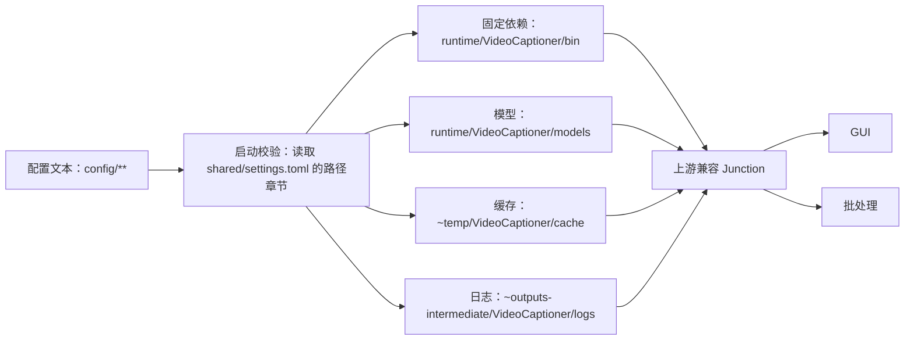

# `config` 目录纯配置化重构计划

## 需求与验收标准

- [x] `D:\CODE\PY\VideoCaptioner\config` 内只保留配置文本文件及用于分类配置的目录，不再保存模型、二进制、缓存、日志、截图或目录联接目标。
- [x] `config` 集中包含当前项目所有“用户可编辑、会改变程序行为”的配置；模型自带的 `tokenizer.json`、模型元数据及上游默认资源不视为用户配置。
- [x] 所有可配置项按三层分类：批处理改写值、对应的上游 GUI 原始值、批处理未改写的共用值；GUI 与批处理分别合并自己的覆盖层，不再维护两个无关联的完整设置副本。
- [x] 配置先按三个模式目录分类；每个目录只维护一份主配置文件，在文件内部按业务章节和子章节组织，再按用户修改频率排序。源视频语言和目标字幕语言属于最常修改项，必须放在各模式配置文件的最前面。
- [x] 迁移不丢失现有约 7.84 GB 运行资源、模型、缓存和日志；旧文件默认归档，不物理删除。
- [x] 迁移后 GUI、批处理、FasterWhisper/CUDA、DeepSeek 翻译、缓存、日志、实时批次 JSONL 均可正常工作。
- [x] 更新 README、CHANGELOG、AGENT_CONTEXT、测试及大资源重建说明，并提交本任务范围内可安全分离的 Git 修改。
- [x] 整理“相对固定上游，本项目做了什么改动”的可追溯清单；保留全部现有功能的前提下，减少重复适配、重复配置和不必要的 monkey patch，不直接修改固定上游源码。

## 当前结构与可复用能力

- `config/batch/batch_config.toml` 是批处理配置，当前由 `scripts/headless_batch.py` 直接读取。
- `config/gui/settings.json` 是 GUI 配置，当前由 `local_patch/videocaptioner_gui_config_path.py` 重定向读取；`settings.example.json` 是可公开模板。
- `config/VideoCaptioner/AppData` 约 1.51 GiB，保存模型、缓存和日志；`reference/upstream/VideoCaptioner/AppData` 是指向它的 Junction。
- `config/VideoCaptioner/resource/bin` 约 5.83 GiB，保存 Faster-Whisper-XXL 及相关运行文件；`reference/upstream/VideoCaptioner/resource/bin` 是指向它的 Junction。
- `config/VideoCaptioner/settings.json`、根层 `cache/`、`logs/`、空 `models/`、`resource/subtitle_style/` 和 `VideoCaptioner.ini` 属于旧结构或旧状态，不是当前主要配置入口。
- 四张 `Desktop Screenshot*.png` 未被代码引用，是旧 GUI 设置和失败现场截图，包含视频缩略图及字幕等潜在隐私内容。
- 可继续复用上游既有路径，不修改固定上游源码：将 Junction 改为指向新位置，或在 Junction 下按模型、缓存、日志分别映射。
- 本任务是现有项目内部目录重构，不需要 GitHub 调研，也不引入新的上游项目。
- `reference/upstream/VideoCaptioner` 当前 Git 工作树干净；本项目主要通过 `local_patch/`、`scripts/headless_batch.py`、`start.bat` 和 `batch_videos.bat` 扩展上游，应继续保持这一隔离方式。

## 本项目相对上游的现有改动清单

| 改动 | 当前接入点 | 目的 | 重构原则 |
|---|---|---|---|
| 无界面批处理编排 | `scripts/headless_batch.py`、`batch_videos.bat` | 递归扫描、GPU 门禁、转录、翻译、校验、发布、轮末重试和报告 | 保留为项目独立编排层，不塞入上游 GUI 线程或直接修改上游队列 |
| GUI 项目配置路径 | `videocaptioner_gui_config_path.py` | 将 GUI 设置从上游运行目录分离 | 合并进统一三层配置桥接，删除独立的单用途路径补丁 |
| 共享 DeepSeek 密钥 | `videocaptioner_shared_secret.py` | GUI 与批处理运行时从 `secrets/` 读取，不写入普通设置 | 合并进统一配置/密钥桥接，但密钥正文继续独立管理 |
| GUI 输出格式修复 | `videocaptioner_output_format_fix.py` | 确保 GUI 完整流程只发布用户选择的字幕格式 | 用现有回归测试证明必要性；若上游现版本已覆盖则移除，否则保留最小钩子 |
| Windows 日志轮转修复 | `videocaptioner_logging_fix.py` | 合并同文件处理器，处理 `WinError 32` | 保留职责独立；仅删除与上游现实现重复的部分 |
| 并发请求日志配对修复 | `videocaptioner_request_logger_fix.py` | 将响应严格关联到原始 HTTP 请求并保留传输错误 | 保留职责独立；不得与普通日志轮转代码混为一体 |
| 翻译完整性与缓存修复 | `videocaptioner_translation_resilience_fix.py` | 拒绝空译文缓存、句级补译、保护纯标点；请求级自动重试已关闭 | 移除批处理内重复的 LLM 非空校验，只保留一处权威实现 |
| 批处理 Token/费用统计 | `headless_batch.py` 的响应钩子 | 按真实响应累计 Token 与人民币费用 | 保留为批处理观察层，不改上游响应对象和业务流程 |
| 严格 SRT 校验及原子发布 | `headless_batch.py` | 防止发布空白、缺译、错位或损坏字幕 | 保留在批处理输出边界，不侵入上游通用 SRT 实现 |
| 项目运行资源 Junction | `reference/upstream/.../AppData`、`resource/bin` | 复用上游路径同时把本地大文件放到项目管理位置 | 改由统一启动准备器创建和验证，不手改上游路径常量 |

## 上游改动最小化原则

- 固定上游目录必须继续保持干净、可用固定版本重建；除 Junction 挂载点外，不直接编辑上游源码、配置或资源文件。
- 项目扩展优先放在一个统一配置桥接模块、一个运行目录准备模块和批处理编排层；不为同一职责叠加多个 hook。
- “精简”以减少重复行为和侵入点为目标，不强行把日志、请求关联、输出格式等不同职责合成一个难以测试的大补丁。
- 每个 monkey patch 必须具备：明确的上游缺口、最小替换范围、幂等安装、对应回归测试和可移除条件。
- 对每个补丁先运行能在未安装补丁时复现上游缺口的测试；无法证明仍有必要的补丁移入归档，不继续自动安装。
- GUI 与批处理共用的修复只安装一次；批处理专属观察或策略留在批处理编排层，禁止再次覆盖同一个上游方法。
- 三层配置适配只发生在项目边界：GUI 获得临时合并后的上游格式，批处理获得强类型配置对象，上游内部不感知三层目录结构。

## 方案比较

### 路线 A：按职责拆分（推荐）

- 固定但体积较大的运行依赖：`runtime/VideoCaptioner/`。
  - `runtime/VideoCaptioner/bin/`：Faster-Whisper-XXL 及运行文件。
  - `runtime/VideoCaptioner/models/`：FasterWhisper 模型。
  - 同目录提供资源说明与独立重建/下载脚本；真实大文件不纳入 Git。
- 可重建缓存：`~temp/VideoCaptioner/cache/`。
- 需审计的运行日志：`~outputs-intermediate/VideoCaptioner/logs/`。
- 上游 `AppData` 调整为本地容器目录，其 `models`、`cache`、`logs` 分别通过 Junction 指向上述位置；`resource/bin` Junction 指向新 `runtime`。
- 在 `config/shared/settings.toml` 的路径章节集中声明所有运行数据路径；启动前由项目脚本校验并在必要时重建 Junction。
- 优点：配置、固定依赖、缓存、日志职责清晰，符合项目文件规则；缺点：迁移和启动校验代码较多。

### 路线 B：统一放入单一运行目录

- 将模型、二进制、缓存和日志全部放入 `runtime/VideoCaptioner/`。
- `config/shared/settings.toml` 的路径章节只声明这一处根目录，上游两个 Junction 改指向新位置。
- 优点：结构最简单；缺点：固定资源和频繁变化的缓存、日志混在一起，备份、清理和审计边界较差。

### 排除路线：直接移动到 `reference/upstream/VideoCaptioner/`

- 排除原因：会让固定上游副本混入可变缓存和日志，破坏上游只读、可重建边界。

## 推荐数据流



## 三层配置模型

用户已明确要求按本项目相对上游 GUI 的改动分类为三个文件夹：

1. `config/batch/`：本项目批处理模式修改的设置。
2. `config/gui/`：与上述修改项一一对应的上游原始 GUI 模式设置。
3. `config/shared/`：批处理没有修改、两种模式共用的设置。

有效配置按以下优先级合并：

```text
GUI 有效设置   = shared + gui
批处理有效设置 = shared + batch
```

- 同一个被批处理改变的逻辑字段必须同时在 `batch` 和 `gui` 中存在，并使用相同规范字段名，便于逐项比较。
- 凡是本项目新增的功能开关，不论上游 GUI 原来是否存在，都必须在 `batch` 和 `gui` 中成对声明：
  - `batch` 写当前真实启用状态；新功能已启用写 `true`，已实现但当前未启用写 `false`。
  - `gui` 一律写 `false`，确保 GUI 不会因共用配置而意外启用批处理新增能力。
- 新功能不是布尔开关时，在 `batch` 保存当前实际值，并在 `gui` 保存明确的禁用值或空值；配置 schema 必须定义该字段如何判定为禁用。
- 未被批处理改变的字段只在 `shared` 中保存一份，不得复制到另外两个目录。
- 项目提供统一的配置加载、合并、类型转换和校验模块；GUI 需要的上游 QConfig JSON 结构由适配器在 `~temp/` 生成，不在 `config` 中再维护第四份合并文件。
- 三个目录都使用职责明确的文本配置；公开 `.example` 文件不含真实值。
- 真实 API Key、Cookie 或其他密钥不是普通配置值，继续保存在 `secrets/`；配置中只记录密钥文件路径或空占位。

## 配置边界

迁移完成后，`config/` 计划只包含：

```text
config/
├── batch/
│   └── settings.toml
├── gui/
│   ├── settings.toml
│   └── settings.example.toml
└── shared/
    └── settings.toml
```

- `batch/settings.toml`：批处理相对 GUI 改写的值及批处理新增功能的实际开关。
- `gui/settings.toml`：对应字段的上游 GUI 原始值，以及 GUI 专属界面设置。
- `gui/settings.example.toml`：不含真实值的公开模板。
- `shared/settings.toml`：批处理未改写的共用值，以及共用路径、缓存、日志和价格设置。
- 上游内置字幕样式、模型 JSON、tokenizer、词表等属于资源内部组成，不搬入 `config/`。

### 配置排序规则

- 第一层按模式职责：`batch`、`gui`、`shared`。
- 第二层在每个 `settings.toml` 内按业务章节和子章节组织：语言、转录、翻译、输出、交互/界面、路径、缓存、日志、价格、高级设置。
- 第三层按修改频率排序：常改章节在前，偶尔修改章节居中，兼容或维护章节在后；同一章节内也按常改字段优先排列。
- `batch/settings.toml` 与 `gui/settings.toml` 使用相同章节名和规范字段路径，以便直接对比。
- 配置覆盖只由 `shared + mode` 规则决定，不由 TOML 章节先后顺序决定；任何重复归属或单侧缺项都应报错。
- 每个字段使用相邻简体中文注释说明用途、可选值、当前状态、修改影响和是否需要重启；不把整份说明复制到其他文档。

最常修改的语言配置示例：

```toml
# config/batch/settings.toml 的第一个业务章节
[language.video]
# 源视频中的语音语言；FasterWhisper 批处理不支持 auto。
source = "ja"

# 最终字幕译文语言。
target = "zh-Hans"
```

### 本项目新增功能的配置示例

```toml
# config/batch/settings.toml 中相应业务章节的项目功能区
[project_features]
gpu_start_gate = true
round_end_retry_menu = true
realtime_batch_journal = true
request_level_auto_retry = false

[transcription]
vad_filter = false
```

```toml
# config/gui/settings.toml 中相应业务章节的项目功能区
[project_features]
gpu_start_gate = false
round_end_retry_menu = false
realtime_batch_journal = false
request_level_auto_retry = false

[transcription]
vad_filter = false
```

其中 `request_level_auto_retry` 表示本项目新增的功能路径存在但当前关闭；`vad_filter` 是上游已有能力但被本项目批处理关闭，因此不归入 `project_features`，但仍在两侧明确写出实际值。

## 未集中到 `config` 的现有参数审计

### 建议进入批处理配置的行为参数

当前代码存在以下可选行为，但尚未由 `config/batch/batch_config.toml` 作为唯一数据源驱动：

- GPU 门禁：是否启用、GPU 索引（当前 `0`）、忙碌阈值（当前 `60%`）、轮询间隔（当前 `10s`）、`nvidia-smi` 查询超时（当前 `5s`）。
- 转录细项：逐词时间戳、输出格式、音轨索引、人声分离、逐词分段、FasterWhisper prompt。
- 翻译细项：是否翻译、是否反思翻译、是否优化、是否断句、CJK/英文最大字数、自定义 prompt、翻译缓存开关和缓存有效期（当前 7 天）。
- DeepSeek 请求策略：请求级自动重试是否启用（当前固定关闭）；若未来启用时的次数和退避策略不应继续散落在代码中。
- 输入输出策略：支持的视频扩展名、已有同名 SRT 的默认处理方式、最终字幕格式和命名、临时目录、报告目录、实时批次日志目录。
- 交互策略：批次开始确认、轮末默认重试选择、一次性模式结束后是否暂停。

### 建议进入运行路径配置的环境参数

- FFmpeg 路径目前在两个 BAT 和 Python 中重复硬编码。
- Faster-Whisper-XXL、模型、共享密钥、缓存、日志、批次日志、最终报告和临时文件路径目前分散在 Python、BAT 与 Junction 中。
- 这些路径应由 `config/shared/settings.toml` 的 `[paths]` 及其子章节统一声明；密钥正文仍只存放在 `secrets/`，配置只允许记录密钥文件路径。

### 已存在于 GUI 配置、但批处理没有对应入口的上游选项

- ASR 引擎、Whisper/Whisper API、FasterWhisper 模型与设备、VAD、人声分离、逐词字幕和 prompt。
- OpenAI、DeepSeek、SiliconCloud、Ollama、LM Studio、Gemini、ChatGLM、DeepLX 等翻译服务及模型/API 地址。
- 翻译线程数、批大小、反思翻译、优化、断句、最大字数和自定义 prompt。
- 输出格式、工作目录、字幕布局、字幕样式、软/硬字幕、视频质量和是否合成视频。
- GUI 主题、DPI、语言、启动检查更新和缓存开关。

上游所有现存可配置项都会进入三层配置清单；配置中出现某个上游选项不代表批处理必须实现该处理路线。批处理仍只执行自身覆盖层明确选定并已验证的路线，其他上游选项由 GUI 使用或作为共用值保留。

### 不建议作为用户配置的内部常量

- SRT 时间轴解析正则、密钥脱敏正则、错误分类规则。
- JSONL 事件名称、时间戳格式、原子发布临时文件前后缀。
- 控制台宽字符计算和光标重绘实现。
- 锁、线程同步、异常类型与内部缓存键算法。

### 当前配置与实际运行的重复问题

- `[fixed]` 中的 `asr_model`、`device`、`vad_method`、`vad_threshold`、`thread_num`、`batch_size`、`layout` 等同时又在 Python 构造器中写死。
- `synthesize = false` 只用于固定值校验；批处理本身没有视频合成代码路径。
- 重构后必须改为“配置值经过校验后直接驱动运行”，不得继续维护两份可能漂移的值。

## 迁移实施

- [x] 完整记录迁移前路径、大小、Junction 目标和关键文件校验值。
- [x] 建立 `config/batch/settings.toml`、`config/gui/settings.toml`、`config/shared/settings.toml` 三层主配置，迁移全部现有可配置项并保留字段来源映射。
- [x] 按业务章节、子章节和修改频率组织三个主配置文件；将源视频语言、目标字幕语言放入 `batch/gui/settings.toml` 首个业务章节。
- [x] 新增统一配置加载器：规范化字段、合并 `shared + mode`、严格校验未知项和缺项，并为上游 GUI 生成临时 QConfig JSON。
- [x] 在 `config/shared/settings.toml` 新增路径章节及路径加载、校验和 Junction 准备逻辑。
- [x] 修改 `start.bat`、`batch_videos.bat` 和批处理路径常量，使启动前先验证运行布局。
- [x] 按确认路线创建目标目录并在同一磁盘上移动现有模型、二进制、缓存和日志。
- [x] 将 `reference/upstream/VideoCaptioner/AppData` 与 `resource/bin` Junction 安全改指向新布局；操作前后逐一验证绝对目标。
- [x] 检查旧 `config/VideoCaptioner/settings.json` 与当前 `config/gui/settings.json`：仅迁移当前配置缺失且仍受支持的设置，不覆盖现有用户值，不输出疑似密钥；迁移后拆分到三层配置。
- [x] 将旧根层缓存、日志、空目录、旧字幕样式副本、`VideoCaptioner.ini` 和截图按确认策略归档或迁移。
- [x] 为 Faster-Whisper-XXL 与模型补齐同名资源说明及独立重建/下载脚本，记录版本或校验值。
- [x] 收紧 `.gitignore`：只忽略明确的大资源、缓存、日志和本地 GUI 设置，不使用宽泛规则隐藏普通项目文件。
- [x] 更新 README、CHANGELOG、AGENT_CONTEXT，并补充目录边界与恢复方法。
- [x] 为上表每项改动记录：对应上游行为、项目差异、必要性证据、保留/合并/移除结论和测试。
- [x] 合并 `videocaptioner_gui_config_path.py` 与配置读取职责到统一配置桥接；共享密钥注入沿用独立安全边界，但避免重复读取和重复 hook。
- [x] 删除 `headless_batch.py` 与 `videocaptioner_translation_resilience_fix.py` 之间重复的 LLM 空译文校验，以补丁模块为唯一权威实现。
- [x] 审核 `sitecustomize.py` 的安装清单：GUI 只安装其实际需要的补丁；批处理只安装共用修复和批处理必需修复。
- [x] 不再需要的补丁或旧适配器按项目规则移动到 `~archive/<时间>-精简上游改动/`，不物理删除。

## 测试与验证

- [x] 静态检查：`config/` 内不存在图片、数据库、日志、模型、二进制、压缩包或 Junction。
- [x] 分类测试：每个规范配置字段只能位于 `shared`，或同时位于 `batch` 与 `gui`；不得遗漏、重复到三层或只有单侧覆盖。
- [x] 排序测试：验证三个主配置文件的章节对应关系和语言章节首位规则；验证有效配置不依赖 TOML 章节书写顺序。
- [x] 新功能测试：每个本项目新增功能都必须在 `batch`/`gui` 成对存在；GUI 值必须为禁用态，批处理值必须与实际运行状态一致。
- [x] 合并测试：验证 `shared + batch` 与 `shared + gui` 的有效值、优先级、类型和完整性。
- [x] 路径测试：新路径配置能正确解析相对路径和项目绝对路径，并拒绝缺项或越界路径。
- [x] Junction 测试：每个 Junction 的解析目标与计划目标完全一致。
- [x] 资源测试：Faster-Whisper 可执行文件和 `medium` 模型完整存在，迁移前后关键文件哈希一致。
- [x] 运行测试：完整 `unittest` 测试集通过。
- [x] GUI 冒烟：启动成功、正确合并 `shared + gui` 并生成临时上游格式、能识别模型与 FasterWhisper。
- [x] 批处理冒烟：使用本地最小样例完成配置加载、资源发现和转录；真实 DeepSeek 请求仅在已有授权范围内进行。
- [x] 日志/缓存验证：新日志和缓存只写入所选目标，不重新生成 `config/VideoCaptioner`。
- [x] Git 检查：不暂存真实密钥、大模型、运行二进制、活动缓存和日志；隐私截图仅进入不远程发布的可恢复归档，不混入任务外修改。
- [x] 上游纯净验证：`git -C reference/upstream/VideoCaptioner status --short` 为空，并验证固定上游版本未改变。
- [x] 补丁必要性验证：每个保留补丁的上游缺口测试与安装后回归测试均通过；被移除补丁的功能由统一实现覆盖。
- [x] 重复 hook 检查：同一上游方法不被 GUI 启动、批处理启动和运行阶段重复替换。

## 需要一次性确认的事项

### A. 非配置文件的新布局

- **A1（推荐）：**路线 A，固定资源、缓存和日志按职责拆分。
- **A2：**路线 B，全部集中到 `runtime/VideoCaptioner/`。

### B. 四张隐私截图

- **B1（推荐）：**移动到 `~archive/<时间>-config目录整理/config/`，保留可恢复副本。
- **B2：**移动到 `data/diagnostics/VideoCaptioner/` 作为长期排障资料并纳入本地 Git；远程发布前需再次检查隐私。

### C. 旧配置和旧状态

- **C1（推荐）：**对比并合并仍有效且当前缺失的设置，然后将旧 `settings.json`、`VideoCaptioner.ini`、旧根层缓存/日志/空目录和旧字幕样式副本统一归档。
- **C2：**不合并任何旧值，直接归档旧结构；以当前 `batch/` 与 `gui/` 为唯一配置来源。

### D. GitHub 调研

- **D1（推荐）：**不调研；这是项目内部路径整理，现有能力足够。
- **D2：**先调研其他开源项目的 portable runtime 布局，再修改本计划。

### E. 执行授权

- **E1（推荐）：**确认计划后，授权移动上述约 7.84 GB 文件、重建准确 Junction、归档旧内容、修改代码/文档/测试，并提交仅本任务范围且可安全分离的变更；禁止物理删除和远程发布。
- **E2：**只修改代码和配置结构，不移动现有运行数据；新结构留待手工迁移。

### F. 配置分类范围（用户已确定）

- **已确定：**分类补入全部现存可配置项，采用 `batch`、`gui`、`shared` 三层覆盖模型。
- 批处理相对 GUI 改写的字段在 `batch` 与 `gui` 中成对保存；批处理未改写的字段只在 `shared` 保存。
- 本项目新增功能在 `batch` 中记录真实开关状态，在 `gui` 中固定记录为关闭；已实现但未启用的新功能在两侧均写关闭。
- 纯内部实现常量不伪装成用户配置；真实密钥继续由 `secrets/` 管理。

### G. 上游改动边界（用户已确定）

- 整理并记录本项目相对上游的全部改动。
- 保留现有功能和已验证修复，同时把直接上游改动、重复 hook 和重复配置降到最低。
- 固定上游源码继续保持干净；项目差异通过最小适配层和独立批处理编排实现。

### H. 配置组织顺序（用户已确定）

- 只按 `batch`、`gui`、`shared` 分成三个目录；不得再按业务子类拆成多个配置文件。
- 每个目录维护一份 `settings.toml` 主配置，在文件内部按业务章节和子章节分类，再按修改频率排序。
- 源视频语言和目标字幕语言是常改项，固定放在 `batch/gui/settings.toml` 的第一个业务章节。
- 罕见修改的兼容、日志、路径和价格章节放在对应主配置文件末尾。

请确认剩余选择并最终批准本计划，建议回复：`A1 B1 C1 D1 E1，确认计划`。

用户已用全局快捷回复 `v` 并再次确认“是”，等同批准推荐的 `A1 B1 C1 D1 E1`；实施未进行物理删除或远程发布。

## 完成证据

- 实现提交：`e78321d refactor config and runtime layout`。
- 全量回归：73 项测试通过。
- 迁移校验：Faster-Whisper-XXL、FFmpeg、medium `model.bin` 的迁移前后 SHA-256 一致。
- GUI 冒烟：成功生成并加载临时 QConfig，VAD/模型/语言正确，DeepSeek Key 字段为空。
- 上游校验：`git -C reference/upstream/VideoCaptioner status --short` 无输出。
