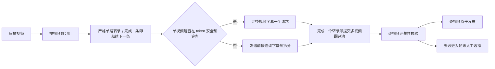

# DeepSeek 视频级批量翻译改造计划

## 需求与验收标准

- 将当前“每 10 句一个 DeepSeek 请求”改为以视频为主要翻译单元：正常视频的完整字幕一次提交，避免反复发送提示词及反复启动模型推理。
- 批处理层以多个视频组成一个翻译批次；同一批内允许多个“每视频一请求”并发执行，但不默认把多个视频混入同一个 API 请求。
- 超长视频必须在发送前按 token 预算确定性拆分，不能等 API 截断或失败后自动重试。
- 继续关闭 DeepSeek 请求级自动重试；HTTP 限流重试、空响应重试、格式修复续问均不得静默产生第二次请求。失败仍进入现有轮末人工选择流程。
- 保持 VAD 关闭，不改变转录、双语 SRT 校验、原子发布、缓存、报告和 GUI 的既有功能。
- 新增设置按项目三层配置规则写入 `config/batch/settings.toml` 与 `config/gui/settings.toml`：批处理写实际启用值，GUI 写关闭值；共用的模型能力参数放入 `config/shared/settings.toml`。
- 不直接修改固定上游源码；优先复用上游 `LLMTranslator`、`SubtitleThread`、缓存和 SRT 数据结构，只在项目补丁与批处理编排层实现最小适配。
- 完成单元测试、离线容量测试和一次用户明确授权后的真实 DeepSeek 对照测试，再提交本任务修改并归档本计划。

## 当前实现与实测基线

- 上游 `BaseTranslator` 先按 `batch_size` 切字幕，再用 `thread_num` 并行调用 `LLMTranslator._translate_chunk`。本项目当前两项均为 `10`，因此 102 句会拆成 11 个并行 API 请求。
- 当前每个请求都重复发送约 908 个字符的标准系统提示词，并要求返回以字幕编号为键的 JSON。
- 批处理现在逐视频执行“转录 → 翻译 → 校验 → 发布”，多个视频尚未形成先转录、后并发翻译的阶段化批次。
- 指定测试视频 `4k2.me@mdvr00423_3_8k [027Mbps_4096p].mp4` 的历史真实记录：

| 指标 | 当前 10 句一批 |
|---|---:|
| 字幕句数 | 102 |
| DeepSeek 请求 | 11 |
| 输入 token | 4,331 |
| 输出 token | 25,951 |
| 其中思考 token | 24,916 |
| 总 token | 30,282 |
| 当时报告估算费用 | RMB 0.21351032 |

- 这组数据说明：
  - 合并为一请求肯定能省掉 10 份重复提示词和 JSON 外壳，但最多只直接影响 4,331 个输入 token 中的一部分。
  - 输出 token 占总量约 85.7%，其中思考 token 又占输出约 96.0%；当前真正的大头是模型对每个小分块重复思考。
  - 关闭思考模式并减少请求次数预计能明显节省，但“单视频一请求”对思考 token 的实际降幅无法仅靠历史日志精确外推，必须用真实 A/B 请求验证。

## DeepSeek 当前能力约束

- 官方当前模型页标注 `deepseek-flash` 为 1M 上下文、最大 384K 输出，容量上足以容纳绝大多数单视频字幕。
- Chat Completions 文档明确说明 `finish_reason="length"` 代表输出或上下文达到限制；JSON 文档也要求合理设置 `max_tokens`，否则 JSON 可能被中途截断，并提示 JSON 模式偶尔会返回空正文。
- DeepSeek 上下文缓存只对重复前缀生效且为 best-effort。现有 11 个请求的共同系统前缀已有部分缓存命中，因此“少发提示词”的账面费用收益小于原始 token 数的降幅。
- 官方当前 `deepseek-flash` 默认支持思考模式且默认开启；本项目调用没有显式指定 `reasoning_effort`，历史日志也确认产生了大量 `reasoning_tokens`。
- 参考：
  - https://api-docs.deepseek.com/quick_start/pricing/
  - https://api-docs.deepseek.com/api/create-chat-completion/
  - https://api-docs.deepseek.com/guides/json_mode/
  - https://api-docs.deepseek.com/guides/kv_cache/

## 方案比较

### 路线 A：一视频一请求，多视频并发翻译（推荐）

1. 每个普通视频的完整字幕构成一个独立请求，不跨视频混合编号。
2. 批处理按 `videos_per_translation_batch` 组成流水线批次：转录保持严格单路，每完成一个视频便立即提交到 `video_translation_concurrency` 翻译池，同时开始转录下一个，随后逐个校验和原子发布。
3. 发送前估算输入和预期输出 token；超过安全预算的视频按连续字幕区间预先拆分。该拆分是容量规划，不是失败后的自动重试。
4. 翻译显式设置非思考模式，并设置足够但有限的输出预算。
5. 优点：大幅减少请求与重复推理；转录和网络等待可以重叠；视频之间故障隔离；沿用单视频字幕编号、缓存和完整性校验。缺点：临时文件生命周期需要延长到对应翻译任务结束。

### 路线 B：多个视频合并成一个 DeepSeek 请求

1. 一个请求内使用 `video_id + cue_id` 复合键，返回多层 JSON 后再拆回各视频。
2. 优点：请求数和固定提示词理论上最少。
3. 缺点：任何空响应、截断、漏键或 JSON 损坏都会使多个视频一起失败；缓存只能以整组视频为键；单个视频重跑时无法复用整组响应；输出越长越容易错位。
4. 结论：不作为默认方案。对本项目常见的数百句视频，额外节省的一份或数份系统提示词远小于扩大后的失败成本。

### 路线 C：仍按句切分，只把分块放大

1. 将固定 10 句改为 50、100 或 token 自适应分块，视频处理流程不变。
2. 优点：改动最少、失败影响小于整视频。缺点：仍会重复提示词和推理，也没有实现用户要求的多视频翻译批次。
3. 结论：作为超长视频的内部降级机制保留，不作为正常路径。

## 推荐数据流



## 配置设计

建议新增以下规范字段，名称以实现时 schema 校验为准：

```toml
# config/batch/settings.toml
[project_features]
video_level_translation = true
multi_video_translation_batch = true

[translation_batching]
videos_per_batch = 4
video_concurrency = 4
max_input_tokens = 120000
max_output_tokens = 32000
output_reserve_ratio = 2.0
reasoning_effort = "none"

[project_features]
video_level_translation = true
multi_video_translation_batch = true
request_auto_retry = false
```

```toml
# config/gui/settings.toml
[project_features]
video_level_translation = false
multi_video_translation_batch = false
```

- GUI 继续使用上游 10 句分块，确保本项目新增批处理能力不会改变 GUI 行为。
- `videos_per_batch` 决定暂存多少个已转录视频；`video_concurrency` 决定同时发出多少个“单视频请求”。两者分开，避免以后调内存占用时被迫改变 API 并发。
- `max_input_tokens`、`max_output_tokens` 不直接顶到官方极限，先采用保守值；真实 A/B 后再按字幕长度分布调整。
- 原 `translation.batch_size` 对 batch 模式不再代表正常请求大小，只保留为超长视频预拆分的兼容兜底；GUI 值不变。

## 缓存、失败与完整性语义

- 新缓存键必须至少包含：完整源字幕内容、目标语言、模型、提示词、思考模式和分块策略版本，避免旧 10 句缓存与新整视频缓存混用。
- 每视频响应必须严格校验：JSON 对象、键集合完全一致、每项译文非空、最终 SRT 句数一致、原文行不变。
- 禁止以下隐式第二请求：SDK 限流自动重试、LLM agent 的格式修复续问、空响应重试、截断后自动二分重试。
- 超限只允许在首次请求前预拆分；请求发出后的任何失败直接标记该视频失败并进入轮末人工重试菜单。
- 同批其他视频成功时照常发布，不因一个视频失败回滚整批。

## 上游改动最小化

- 不改 `reference/upstream/VideoCaptioner` 中的 Python 源文件。
- 在项目补丁中新增一个职责单一的视频级翻译适配器，复用上游提示词生成、`SubtitleProcessData`、响应校验和目标语言枚举。
- `scripts/headless_batch.py` 只负责小批次编排、并发、临时目录和结果汇总，不复制翻译提示词或 JSON 校验算法。
- GUI 不安装视频级批量翻译补丁；共享的“关闭 DeepSeek 请求自动重试”修复保持最小且由测试证明只发一次请求。

## 实施步骤

1. 先补测试，固定当前 10 句切分基线、每视频完整键集合、超长预拆分、无隐式重试、单视频失败不连带其他视频等行为。
2. 修正 DeepSeek 调用参数：翻译路径显式使用非思考模式、JSON 输出和输出上限；验证 SDK 参数与当前官方 API 兼容。
3. 实现视频级翻译适配器和版本化缓存键；正常视频一次请求，超长视频首次发送前预拆分。
4. 将批处理重构为“严格单路转录 + 已完成转录视频并发翻译”的流水线，分别校验发布，并保留 GPU 门禁、轮末人工重试和每视频 token 统计。
5. 把新增字段补入 batch/gui/shared 三层配置、schema 校验、README、CHANGELOG 与项目改动清单。
6. 运行全部离线测试，并用历史 SRT 做容量模拟，覆盖 1、102、340、791 句等规模。
7. 用户已授权使用指定 `MDVR-423 [025Mbps_4096p]` 目录做真实付费 2×2 对照。复用历史请求日志中的 60、5、102 句源字幕，不重新转录；四组均使用相同源文、模型和提示词，比较请求数、输入/正文输出/思考 token、耗时、费用、漏句和译文质量，且不覆盖现有正式 SRT：开思考＋10 句、关思考＋10 句、开思考＋整视频、关思考＋整视频。
8. 根据结果调整安全预算和并发默认值，提交本任务范围修改，将计划移至 `docs/finished_plans/`，并在 `docs/lessons/` 写复盘。

## 真实 2×2 实测结果（2026-10-01）

语料来自用户指定目录的三个视频，共 60、5、102 句（合计 167 句）。四组重新请求，模型、提示词和源字幕完全一致；SDK `max_retries=0`，没有格式修复续问或失败补发。四组均一次通过完整键集合、非空译文和 `finish_reason=stop` 校验。

| 模式 | 请求 | 输入 token | 正文输出 | 思考 token | 总 token | 墙钟耗时 |
|---|---:|---:|---:|---:|---:|---:|
| 开思考＋10 句 | 18 | 7,119 | 1,742 | 44,065 | 52,926 | 64.062 秒 |
| 关思考＋10 句 | 18 | 6,669 | 1,707 | 0 | 8,376 | 3.344 秒 |
| 开思考＋整视频 | 3 | 2,572 | 1,648 | 22,765 | 26,985 | 44.859 秒 |
| 关思考＋整视频 | 3 | 2,497 | 1,681 | 0 | 4,178 | 4.985 秒 |

- 单独关闭思考（保持 10 句）使总 token 减少 84.2%；说明主要浪费来自每个小请求重复思考。
- 单独改整视频（保持思考）使总 token 减少 49.0%；说明合并请求也显著减少提示词和重复推理。
- 两项同时启用相对当前基线使请求减少 83.3%、输入 token 减少 64.9%、总 token 减少 92.1%。
- 关思考时，整视频相对 10 句模式总 token 再减少 50.1%；墙钟耗时由 3.344 秒增至 4.985 秒，是因为 10 句模式的 18 个短请求高度并发。约 1.6 秒的差异远小于请求数、费用和故障面的收益。
- 按测试时官方 `deepseek-flash` 单价估算，四组谷时费用依次约为 `$0.02793127`、`$0.00200573`、`$0.01490189`、`$0.00128907`；峰时约为两倍。推荐组相对当前基线费用减少约 95.4%。
- 四组输出都完整，但模型生成具有随机性，不能用逐字相同率替代人工质量判断。两组关思考结果中 95/167 句完全相同，其余主要为措辞差异；整视频结果可利用全片上下文，后续正式接入仍需保留抽样检查。
- 完整原始报告保存在忽略 Git 的 `~outputs-intermediate/VideoCaptioner/benchmarks/translation-matrix-20261001-213007.json`，其中包含每个请求的 usage、耗时、响应与校验状态。

## 已确认并完成的决策

用户已用 `v` 确认 **A1 + B1 + C1 + D2**，实现和实测均按此组合完成：

- **A1（已采用）**：一个视频一个请求；多个视频只在批处理调度层并发，不混进同一请求。
  **A2**：多个视频合并为同一个 DeepSeek 请求。
- **B1（已采用）**：翻译显式关闭思考模式 `reasoning_effort="none"`。
  **B2**：保留 DeepSeek 默认思考模式，仅改变分批。
- **C1（已采用）**：默认每批 4 个视频、最多 4 个视频翻译请求并发，之后可在 config 修改。
  **C2**：采用其他默认批次/并发数，请指定两个数字。
- **D2（已确认）**：本次对指定目录中三个视频的已有源字幕输入执行四组真实付费对照；不重新转录、不覆盖正式字幕。SDK 和业务层均禁止自动重试，失败请求只记录一次。

最终验证：82 项单元测试通过；5 句生产路径冒烟测试只产生 1 次请求、388 总 token、0 思考 token；固定上游工作树保持干净。
